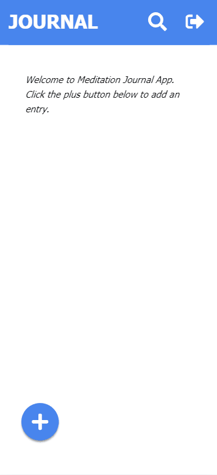

# React Meditation Journal App

Meditation Journal App is a simple web app that allows a user to journal their experiences in their meditation practice.

  

Live Demo [Here](https://meditation-journal.netlify.app/)

## Technologies

This project was built with <a href="https://reactjs.org/">React</a> and <a href="https://redux.js.org/">Redux</a> and utilises Firebase for authentication and data storage.

## User Stories

- A user can login with Google

- A user can create a new journal entry with optional title and adjust the date and time

- A user should see all journal entries on the dashboard

- A user can click any entry to edit its title, entry text, date or time or delete it

- A user can search all entries by title or entry text

- A user can logout
